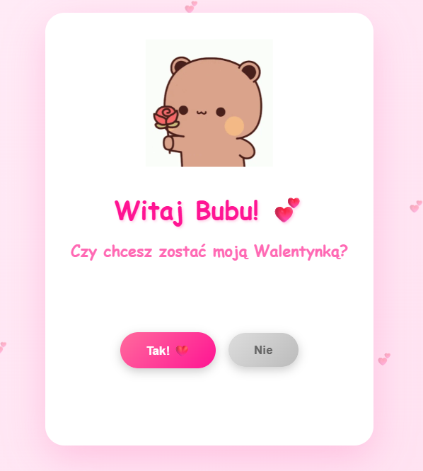
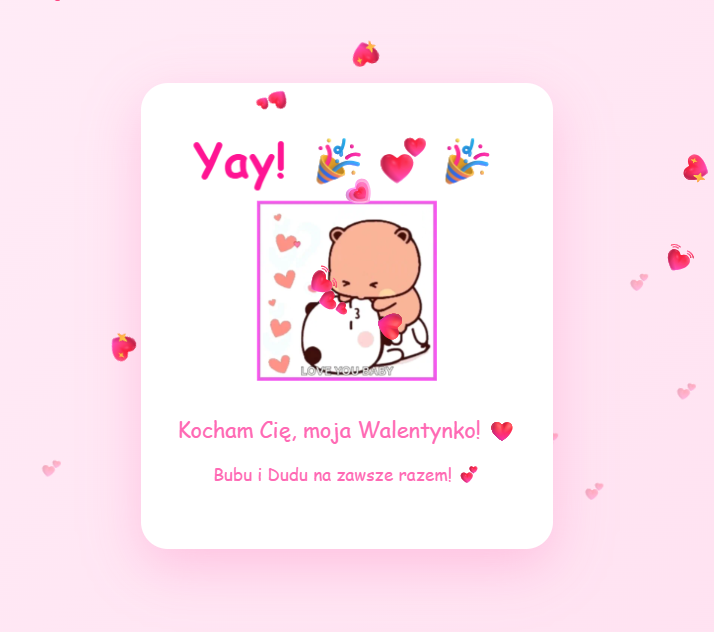

# 💕 Bubu Valentine's Day Card

A cute interactive Valentine's Day web card featuring Bubu & Dudu characters, animated hearts, and a sneaky "No" button that runs away from your cursor.




---

## ✨ Features

- **Animated floating hearts** in the background
- **Bouncing character GIF** (Dudu with a flower 🌸)
- **Runaway "No" button** — tries to escape the cursor so you can't click it
- **Growing "Yes" button** — gets bigger every time "No" escapes
- **Celebration screen** — confetti hearts rain down when you say Yes ❤️
- **Touch support** — works on mobile devices too

---

## 🚀 How to Use

No installation needed. Just open the file in any browser:

```bash
open index.html
```

Or serve it locally:

```bash
npx serve .
# then go to http://localhost:3000
```

---

## 🎮 How It Works

| Element | Behavior |
|---|---|
| `Tak! ❤️` (Yes) button | Click to reveal the celebration screen |
| `Nie` (No) button | Runs away when hovered — impossible to click! |
| Yes button size | Grows +20% every time No escapes |
| Background hearts | 15 floating emoji, randomized positions |
| Celebration | 30 falling hearts animate across the screen |

---

## 🛠️ Tech Stack

- Pure **HTML / CSS / JavaScript** — no frameworks, no dependencies
- CSS animations: `float`, `bounce`, `heartbeat`, `spin`
- Collision detection to prevent the "No" button from overlapping the "Yes" button
- Mouse proximity detection with 500ms throttle for smooth UX

---

## 📁 File Structure

```
.
├── index.html      # The entire app (single file)
└── README.md
```

---

## 💌 Credits

Made with love for Valentine's Day 🐻❤️🐼  
Characters: **Bubu & Dudu**
